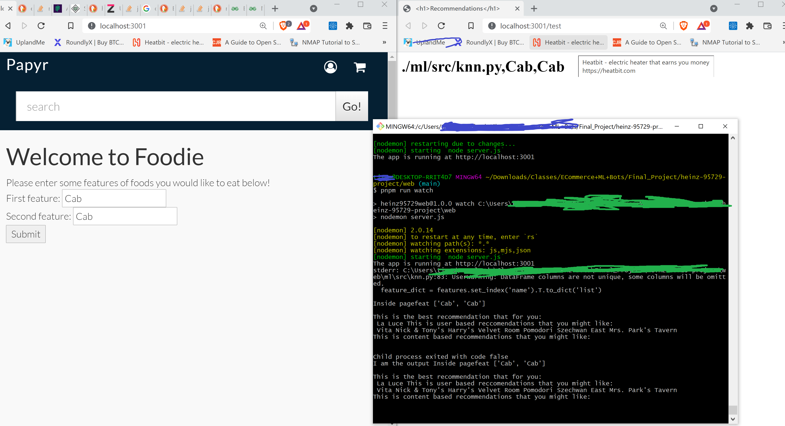

# CMU Heinz 95729 Course Project

This repository provides a foundation for Heinz 95729 E-Commerce Tech course projects that include APIs, and/or web apps.

## Getting Started
1. Move the ML directory into the web folder
2. Follow the [instructions to get the API running](api)
3. Follow the [instructions to get the web app running](web)

## Starting the API

Also see the [API README](api/README.md)

```Shell
cd api
pnpm run watch
```

## Starting the Web app

Also see the [web README](web/README.md)

```Shell
cd web
pnpm run watch
```

Navigate to http://localhost:3001 to see the app


Note: To run the application properly there are a couple of things that might also need to be installed via npm check the server.js const "require" variables at the top.
Note: The Server is the intermediary between the python script and the single web page, input must come as a string directly from the web\ml\data\features.txt
The return output will come in the terminal after running and will come from the web\ml\data\chicago.txt 

## Python 
Python is necessary in the bash environment in order to allow the ML algorithm to work one should have at least python 3.4 or above
```bash
pip install pathlib
pip install argparse
pip install pandas
pip install scipy
pip install sklearn 
```
