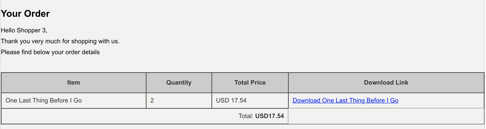

# Orders

#### This section provides an example for documenting a data-type.

Products `/orders` of any type have the following schema:

| Property | Type                 | Description                                                  |
| -------- | -------------------- | ------------------------------------------------------------ |
| _id      | ObjectID             | The unique identifier                                        |
| uid      | string               | A unique human-readable identifier                           |
| item     | array of Json object | An item object to tract each item in the cart (item name, quantity, price and item_uid) |
| total    | number               | Total price of the cart (decimal to 2 places)                |
| created  | date                 | The created time for the order                               |


> # Example Order

```json
{
       "_id": "5de5c78777ec404a1fb09768",
       "uid": "some_complex_uid3",
       "total": "40.46",
       "items": [
           {
               "name": "new book 11",
               "quantity": 2,
               "price": 20.23,
               "item_uid": "some_item_uid"
           }
       ],
       "created": "2019-12-03T02:25:11.887Z"
   }

```


## Find Order `GET`

This endpoint searches for order, by uid  `/orders/:uid`.

> # Parameters

| Name | Type   | Description                                                  |
| ---- | ------ | ------------------------------------------------------------ |
| uid  | string | The human readable ID of the user whose orders are being retrieved |

> # Example Response `200`

```json
 [{
       "_id": "5de5c78777ec404a1fb09768",
       "uid": "some_complex_uid3",
       "total": "40.46",
       "items": [
           {
               "name": "new book 11",
               "quantity": 2,
               "price": 20.23,
               "item_uid": "some_item_uid"
           }
       ],
       "created": "2019-12-03T02:25:11.887Z"
   }]
```


## Add Order `GET`

This endpoint add the order for the user, by user_id `/orders/add/:user_id`.

> # Parameters

Name | Type | Description
---- | ---- | -----------
 user_id | string | The human readable uid of the user 


> # Example Response `200`

```json
[{
   "messages": [
       "Order created successfully"
   ]
}]
```


## Download Order `GET`

This endpoint add the order for the user, by order_id `/books/download/:uid/:order_id`.

> # Parameters

| Name     | Type   | Description                                                  |
| -------- | ------ | ------------------------------------------------------------ |
| order_id | string | The human readable uid of the user for whom this order is being createduid of the order |


> # Example Response `200`

Document with mime type of application/pdf to the user's email.



# Orders.js Source

The Order module demonstrates subtype polymorphism in JavaScript. Using `Object.assign`, or the spread operator, we can extend the schema of `Cart`

```javascript
 const Order = immutable('order', {
    //inherit schema from Cart
    ...Cart.blueprint,
    created: 'date',
  })
```


# ordersRepo.js
The productRepo is a service module that can be used to query the database. It is set up to query a single collection: orders.
