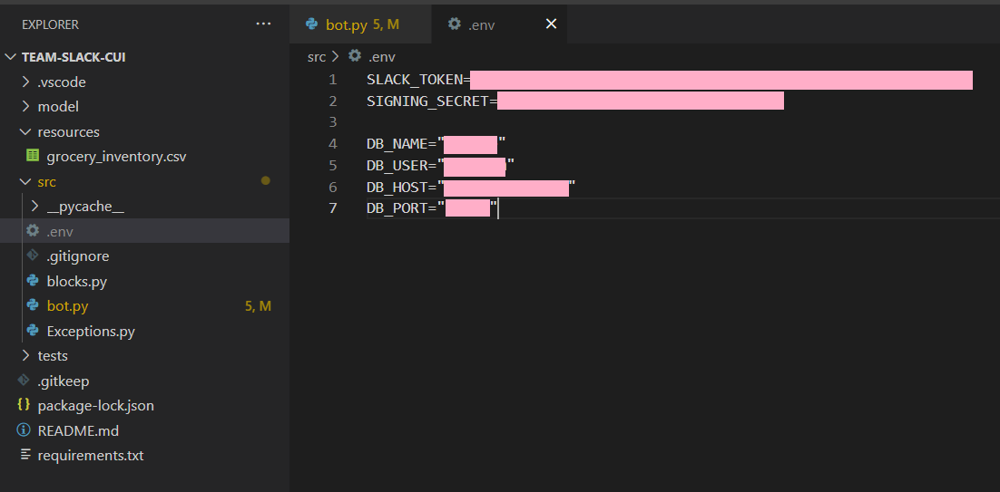

**Activate the virtual environment**
```
USER_PATH\Scripts>activate
```

**Install all packages**
```
pip3 install -r requirements.txt
```

**Run the application**
Make sure to activate the virtual environment
```
python bot.py
```

**Run ngrok**
Make sure to activate the virtual environment, run the application and run ngrok application
```
ngrok http 5000
```

**Change ngrok link in slash commands in bot configurations**
Make sure to activate the virtual environment and run ngrok
```
visit slash commands in  https://api.slack.com/
```

**Add env file as shown below**
Make sure to add it to the correct path

